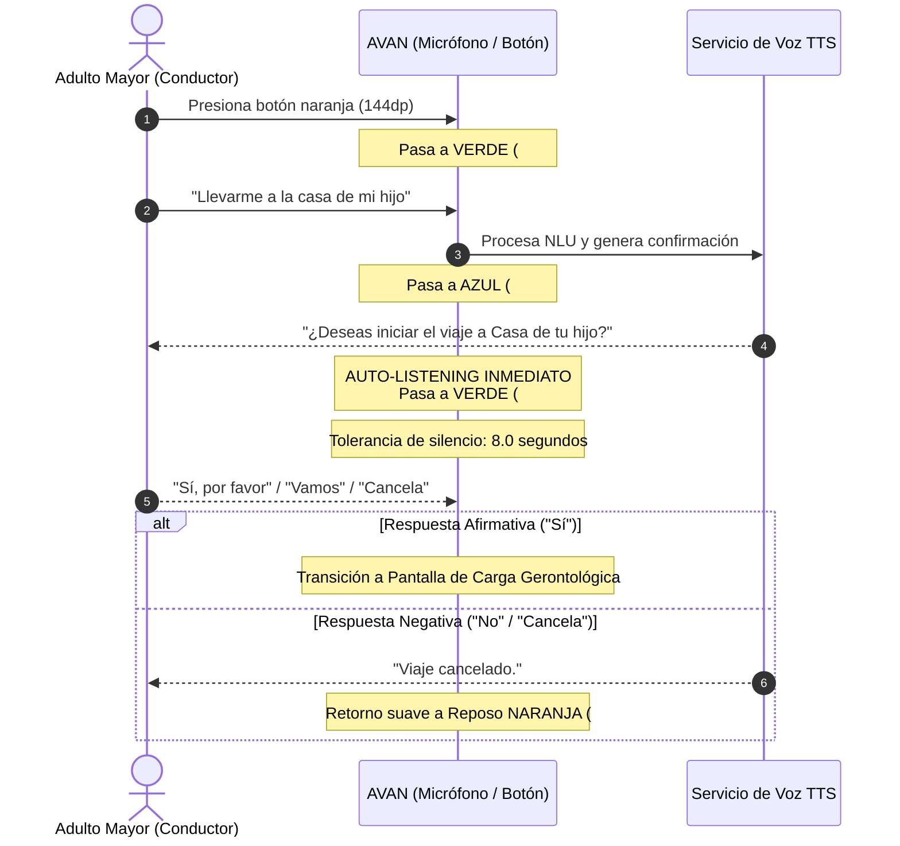

# Especificación de UX y Accesibilidad Gerontológica - Fase 1
**Proyecto AVAN**  
*Autor: Agente de UX / Accesibilidad para Adultos Mayores (02)*  
*Destinatario: Agente Mobile / Frontend (07) y Agente Orquestador (11)*  
*Fecha: 21 de Septiembre de 2026 (Actualizado con Feedback de Usuario)*  

---

## 1. Fundamentos Gerontológicos y Principios de HCI

El diseño de la interfaz de AVAN se fundamenta en la compensación de los cambios cognitivos, sensoriales y motores asociados a la edad adulta avanzada:

1. **Ley de Fitts y Motricidad Fina**: Con la edad se presenta una pérdida progresiva de propiocepción y mayor variabilidad motriz (temblores leves). El tiempo requerido para alcanzar una diana táctil disminuye drásticamente al maximizar su tamaño ($W$) y reducir la distancia de acceso ($D$).
   - **Botón en Reposo**: **144 dp** (área táctil masiva en el centro geométrico).
   - **Botón en Navegación**: **108 dp** (zona inferior central al alcance inmediato).
2. **Ley de Hick y Carga Cognitiva Extrema**: El tiempo de toma de decisiones crece con el número y complejidad de las opciones ($T = b \cdot \log_2(n + 1)$). Para un adulto mayor conduciendo, cualquier elemento superfluo compite por la atención periférica. La pantalla de reposo adopta el paradigma **One-Button UI pura** ($n=1$), eliminando cualquier menú, botón táctil secundario o atajo visual.
3. **Sensibilidad al Contraste y Presbicia**: Cumplimiento riguroso de **WCAG 2.1 Nivel AAA** con relaciones de contraste superiores a 7:1 en textos y 3:1+ en elementos gráficos activos sobre fondos claro (`#F1F4F7`) y oscuro (`#0B111D`).
4. **Tolerancia Temporal y Procesamiento de Lenguaje**: La formulación de oraciones en adultos mayores requiere pausas y vacilaciones naturales. Se establece una tolerancia de silencio de **8.0 segundos completos** antes de considerar un timeout.

---

## 2. Especificación Técnica del Botón Central Sin Texto

El botón no debe contener etiquetas de texto internas para evitar sobrecarga de lectura. La comunicación del estado se realiza exclusivamente mediante el sistema cromático, la iconografía universal y la animación del halo perimetral.

| Estado | Color Central (HEX) | Icono Ionicons | Halo Perimetral | Animación del Halo | Feedback Háptico |
| :--- | :--- | :--- | :--- | :--- | :--- |
| **Inactivo / Reposo** | `#FF5722` (Naranja AVAN) | `mic-outline` (68dp, `#FFFFFF`) | `rgba(255, 87, 34, 0.35)` | **Respiratorio lento**: Ciclo completo de 2200 ms. Escala 1.0 $\to$ 1.12 $\to$ 1.0. Opacidad 0.20 $\to$ 0.55 $\to$ 0.20. | Ninguno en reposo. |
| **Escuchando** | `#22C55E` (Verde Esmeralda) | `mic` (sólido, 68dp, `#FFFFFF`) | `rgba(34, 197, 94, 0.45)` | **Ondas concéntricas expansivas (Sonar/Radar)**: 2 anillos concéntricos con desfase de 180 ms. Onda 1: escala 1.0 $\to$ 1.38; Onda 2: escala 1.0 $\to$ 1.55. Opacidad 0.90 $\to$ 0.25. Ciclo de 750 ms. | **Vibración pesada inicial**: `Haptics.impactAsync(Heavy)` al activarse el micrófono. |
| **Respondiendo / Hablando** | `#3B82F6` (Azul Eléctrico) | `volume-high` (sólido, 68dp, `#FFFFFF`) | `rgba(59, 130, 246, 0.45)` | **Halo continuo oscilante**: Ciclo de 650 ms. Escala 1.0 $\to$ 1.25 $\to$ 1.0. Opacidad 0.40 $\to$ 0.80 $\to$ 0.40. Brillo suave sin deslumbramiento. | Ninguno durante reproducción de voz. |

---

## 3. Regla del Saludo Autodesvanecible (`greetingText`)

- **Contenido**: `"HOLA, [NOMBRE]"` en tipografía sans-serif bold, mayúsculas, tamaño 20-22sp, tracking amplio (letterSpacing 1.5).
- **Regla Temporal**:
  1. Al iniciar la aplicación o volver a la vista de reposo, el saludo se muestra con opacidad 1.0.
  2. Permanece completamente estático durante **4.0 segundos (4000 ms)** para permitir su lectura serena.
  3. Tras cumplir los 4 segundos, se ejecuta una animación de desvanecimiento suave (`Animated.timing`) hacia opacidad 0.0 durante **800 ms** utilizando aceleración de hardware (`useNativeDriver: true`).
  4. Una vez desvanecido, el espacio se mantiene para evitar saltos visuales en la posición del botón central.

---

## 4. Erradicación Total de Elementos Visuales Secundarios en Reposo

Para consolidar el paradigma **One-Button UI pura**, se prohíbe terminantemente la presencia de controles táctiles secundarios en `MinimalHomeScreen`:

1. **Eliminación de Chips de Destinos Frecuentes**:
   - ❌ Eliminar botones inferiores como `"Bellas Artes"` y `"Hospital General"`.
   - *Justificación*: Generan confusión cognitiva sobre si el sistema se opera con toques o por voz, además de incentivar la desviación de la mirada al volante.
2. **Eliminación de Entrada Manual de Texto**:
   - ❌ Eliminar el botón `"Escribir destino"` y su campo de texto `TextInput`.
   - *Justificación*: Un teclado virtual en un contexto vehicular para adultos mayores es un factor crítico de distracción y riesgo de accidente. La interacción es **100% por voz**.
3. **Eliminación de Botones Táctiles de Confirmación**:
   - ❌ Eliminar las píldoras táctiles `"Sí, iniciar viaje"` y `"Cancelar"`.
   - *Justificación*: El flujo de confirmación se realiza de forma natural y conversacional por voz (Auto-Listening).
4. **Eliminación de Barra Superior**:
   - ❌ Cero botones sol/luna y cero botón de ver mapa en reposo.

---

## 5. Flujo de Confirmación 100% por Voz (Auto-Listening)

En el diálogo de confirmación en 2 pasos (Paso 2: verificación de destino):

### Reglas de Implementación de Auto-Listening:
1. Al concluir la locución TTS de la pregunta de confirmación (`onFinishSpeaking` callback), el sistema debe invocar **inmediatamente** `startRecording()`.
2. El botón central pasa a **VERDE (`#22C55E`)**, activa sus **ondas concéntricas de radar** y emite un feedback háptico ligero (`ImpactFeedbackStyle.Medium`).
3. La ventana de tolerancia de silencio se reinicia a **8.0 segundos completos**, otorgando margen amplio para que el adulto mayor responda con soltura.
4. El motor de NLU interpreta respuestas afirmativas directas o coloquiales (*"sí", "vamos", "por favor", "claro", "iniciar", "de acuerdo"*) y cancelaciones (*"no", "cancela", "detener", "espera"*).

---

## 6. Pantalla / Indicador de Carga Gerontológico

Mientras se geocodifica el destino, se calcula la ruta con OpenRouteService y se prepara la transición a `HomeScreen` (mapa activo), es imperativo proveer un estado de carga claro, tranquilizador y de altísimo contraste para mitigar la ansiedad:

### Especificaciones de Diseño del Indicador de Carga:

1. **Estructura y Composición**:
   - Ocupa el centro visual de la pantalla, manteniendo el fondo de alto contraste del tema (`#F1F4F7` en día, `#0B111D` en noche).
   - Todos los eventos táctiles se bloquean temporalmente (`pointerEvents="none"`).
2. **Spinner Accesible Masivo**:
   - Diámetro: **64 a 72 dp** (grosor de trazo de 5-6 dp), evitando los spinners genéricos pequeños e invisibles.
   - Color: Azul primario (`#3B82F6`) o Naranja AVAN (`#FF5722`), asegurando un ratio de contraste $> 7:1$.
3. **Jerarquía Tipográfica (WCAG AAA)**:
   - **Título de Estado** (26-28 sp, Bold, `#111827` en día / `#FFFFFF` en noche, ratio $> 14:1$):
     `"Preparando tu viaje..."` o `"Calculando la mejor ruta..."`
   - **Mensaje Tranquilizador** (18-20 sp, Semi-Bold, `#4B5563` en día / `#94A3B8` en noche, ratio $> 7:1$):
     `"Por favor espera un momento, estamos trazando el camino."`
4. **Retroalimentación Auditiva Simultánea**:
   - A la par del indicador visual, el TTS anuncia: *"Calculando la mejor ruta hacia [Destino], por favor espera un momento."* para que el usuario no necesite fijar la vista en el teléfono.

---

## 7. Checklist de Implementación para el Agente Mobile / Frontend (07)

- [ ] **`MinimalHomeScreen.tsx`**:
  - Eliminar por completo el bloque JSX `actionChipsContainer` (chips de Bellas Artes / Hospital General, botón y campo de teclado, chips táctiles de Sí/Cancelar).
  - En `handleProcessInput`, cuando el asistente termine de formular la pregunta de confirmación (Paso 2), encadenar la escucha automática (`handleVoicePress` o `startRecording`) de inmediato.
  - Implementar el componente/modal de Carga Gerontológica con spinner gigante (64dp), título de 28sp y subtexto tranquilizador de 18sp.
  - Asegurar que la pantalla contenga exclusivamente: Saludo (4s), Textos de estado y Botón central de 144dp.
- [ ] **`VoiceActionButton.tsx`**:
  - Mantener los 3 estados cromáticos (#FF5722, #22C55E, #3B82F6) y sus animaciones de halo.
- [ ] **`theme.ts`**:
  - Validar ratios de contraste de los nuevos textos de carga en modo claro y modo oscuro.
